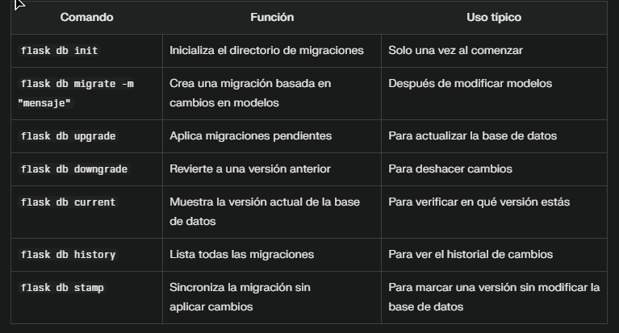

# Cómo usar Flask-Migrate de forma óptima

## Guía paso a paso para gestionar migraciones de manera eficiente

### 1. Inicializar las migraciones (solo una vez)

```
flask db init
```
Crea la carpeta `migrations/`. Solo necesitas hacerlo la primera vez.

---

### 2. Crear una migración después de cambios en modelos

Cada vez que modifiques los modelos, ejecuta:

```
flask db migrate -m "Descripción de los cambios"
```

- `-m`: Especifica un mensaje descriptivo para la migración.  
Este comando analiza los modelos y genera un script de migración en `migrations/versions/`.

---

### 3. Aplicar la migración a la base de datos

```
flask db upgrade
```

Actualiza la base de datos con los cambios de la migración.  
Usa este comando para aplicar todos los cambios pendientes.

---

### 4. Revertir migraciones (opcional)

Para volver a la versión anterior:

```
flask db downgrade
```

Puedes especificar una versión concreta si quieres regresar a un estado anterior.

---

### 5. Ver el estado actual de migraciones

```
flask db current
```

Muestra la versión actual de la base de datos.

---

### 6. Recrear migraciones si hay errores

Si necesitas volver a crear una migración (por ejemplo, si hubo errores):

```
flask db stamp head
flask db migrate -m "Nueva migración"
```

El comando `stamp head` sincroniza la migración sin hacer cambios en la base de datos, útil para resetear migraciones.

---

## Ejemplo visual del uso de migraciones



*Ejemplo de estructura de las `migraciones` .*

---

## Explicación de las mejoras

Se han añadido encabezados y subencabezados para una mejor organización.  
Se usan bloques de código con formato `bash` para resaltar comandos.  
Se incluyen descripciones claras y concisas para cada paso.  
Se mejora la legibilidad general facilitando la comprensión.  
Se añade una imagen para ilustrar la estructura del directorio de migraciones.